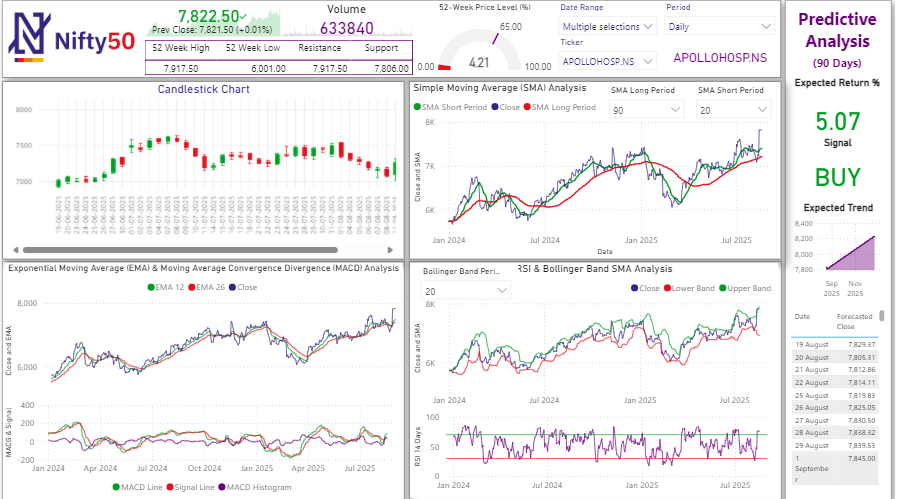

# NIFTY Stock Market Dashboard

## Project Overview

This Power BI dashboard analyzes NIFTY stock market performance using stock price, volume and return data.

The dashboard helps users understand market movement, compare stock performance, identify top gainers and losers, and track price trends over time.

## Tools Used

- Power BI
- Excel
- DAX
- Power Query
- Data Visualization

## Business Problem

Stock market data is large and difficult to analyze manually.  
The goal of this project was to create an interactive dashboard that helps users quickly understand stock trends, volume movement and return performance.

## KPIs

- Total Stocks
- Total Volume
- Average Close Price
- Highest Close Price
- Return %

## Dashboard Features

- Stock price trend analysis
- Top 10 gainers
- Top 10 losers
- Volume comparison
- Ticker slicer
- Year and month filters
- Return percentage calculation

## Key Insights

- Identified stocks with highest return percentage.
- Analyzed high-volume stocks.
- Compared close price movement over time.
- Highlighted top gainers and losers for quick analysis.

## Files Included

- Power BI Dashboard File
- Dataset
- Dashboard Screenshot
- README Documentation

## Author

Mohit Kasana
